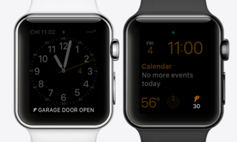
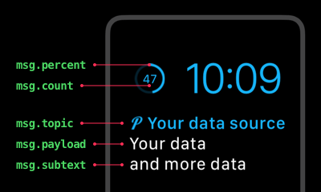

node-red-contrib-pushover
======================

A <a href="http://nodered.org" target="_new">Node-RED</a> node to send alerts via <a href="http://www.pushover.net/" target="_new">Pushover</a>.

Supports rich notification with image attachment.

----

### Install

Run the following command in your Node-RED user directory - typically `~/.node-red`

    npm install node-red-contrib-pushover

### Required Inputs
- `msg.payload`(required): The body of the notification, supports a [few html tags](https://pushover.net/api#html)

### Optional Inputs
- `msg.topic`: This will be used as the title of the notification if **Title** is not set
- `msg.image`: The URL of the image in notification. Local file path or http(s) url
- `msg.url`: Can add an url to your notification
- `msg.url_title`: Can set the title of the url
- `msg.priority`: -2/-1/1/2, [see explain](https://pushover.net/api#priority)
- `msg.device`: Default for all device if not provided. Separated by a comma
- `msg.sound`: Name of the notification sound, [see the list](https://pushover.net/api#sounds)
- `msg.timestamp`: A unix timestamp to specific the date time of your notification

See <a href="https://pushover.net/api" target="_new">Pushover.net</a> for more details.

## Pushover Glances

With Pushover's Glances API, you can push small bits of data directly to a constantly-updated screen, referred to as a widget, such as a complication on your smart watch or a widget on your phone's lock screen.

### Available Inputs
- `msg.payload`: This will be used as the title if **Title** is not set
- `msg.text`: The main line
- `msg.subtext`: The second line
- `msg.count`: The number
- `msg.percent`: The progress bar/circle
- `msg.device`: Device name, default for all

